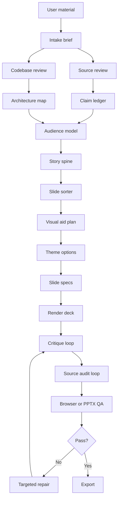

# slides-generator

`slides-generator` is a repo for building source-grounded slide decks with agents.

The goal is not to make slides from a single prompt. The goal is to turn rough material into a deck that is accurate, clear, visually useful, and ready for a real presentation.

This repo is currently in the design and workflow phase. It has the skill, planning structure, guardrails, eval prompts, and compatibility setup for Codex and Claude Code. The renderer and CLI are the next build step.

## Why This Exists

AI can already make a deck that looks finished. That is not the same as making a deck that is true, useful, and easy to present.

The common failure mode is simple: the model writes plausible slides before it has understood the sources, the audience, the story, or the proof. That creates decks with nice surfaces and weak foundations.

`slides-generator` is built around the opposite order:

1. understand the material,
2. decide what the audience needs,
3. verify the claims,
4. design the story,
5. choose visual aids,
6. render,
7. audit,
8. repair.

The repo is meant to help an agent create the first 90 percent of a strong deck while making the remaining 10 percent easy for a human to review.

## What This Is For

Use this repo when you want an agent to help create a serious deck from:

- rough notes,
- PDFs,
- codebases,
- screenshots,
- research material,
- brand guidelines,
- data files,
- existing slide examples.

The deck should explain the idea, not just decorate it. The workflow is especially useful for technical demos, research explainers, architecture decks, hackathon decks, product stories, and decision decks.

## Core Idea

Most AI slide tools do this:

```txt
prompt -> deck
```

This repo uses a safer flow:

```txt
sources -> evidence -> story -> visual aids -> render -> critique -> audit -> QA -> export
```

The important part is that every phase writes an artifact to disk. Those artifacts become the system memory, so a later repair does not need to reread every source file.

## Architecture At A Glance



The pipeline is intentionally split. A bad story should not be fixed by rewriting CSS. A false claim should not be fixed by changing the speaker notes. A crowded diagram should not require rereading every PDF.

## How To Use It Today

### One-Shot Draft Prompt

You should be able to ask for a strong first draft in one prompt, as long as the prompt gives the agent enough constraints.

```txt
Use the slide-generator skill for projects/my-deck.

Create a 10-slide deck about [topic] for [audience].
The deck should help them [understand, decide, believe, or do X].
Use source_only mode and strict source handling.
Use a clean surgical light style unless the sources suggest a better brand-derived direction.
Include visual aids where they clarify comparison, sequence, architecture, or tradeoffs.
Output an HTML draft with concise speaker notes.
Must include [specific items].
Must avoid unsupported claims, fake examples, and generic AI phrasing.

Before rendering, show me the slide sorter, theme direction, and assumptions.
```

If details are missing, the skill asks one batch of material questions. If you want speed, tell it to proceed with defaults. Those defaults should be recorded as assumptions in the project folder.

### 1. Create A Project Folder

Copy the template:

```bash
cp -R projects/_template projects/my-deck
```

Rename `my-deck` to the deck name you want.

### 2. Add Input Material

Put files here:

```txt
projects/my-deck/input/
  brief.md
  sources/
  brand/
  codebase/
  data/
```

Use:

- `sources/` for PDFs, notes, transcripts, articles, or screenshots.
- `brand/` for brand guides, logos, example slides, or visual references.
- `codebase/` for code that the deck should explain.
- `data/` for CSVs, tables, benchmarks, or chart inputs.

Then fill:

```txt
projects/my-deck/input/brief.md
```

At minimum, write the topic, audience, goal, output format, research mode, and any style preference.

### 3. Ask Codex Or Claude Code To Run The Workflow

Use this prompt:

```txt
Use the slide-generator skill for projects/my-deck.

Follow workflows/make-deck.md.
Start with planning artifacts only. Do not render slides until the claim ledger, story spine, slide sorter, visual aid plan, and theme options are ready.
Use source_only mode unless the brief says research is allowed.
```

For Claude Code, you can also ask:

```txt
Use .claude/commands/make-deck.md for projects/my-deck.
Use the slide-generator skill.
```

If the deck involves code, add:

```txt
Review the codebase before planning slides. Create codebase-review.md, architecture-map.json, code-snippets.json, and demo-path.md before writing architecture slides.
```

If the deck involves a brand, add:

```txt
Create brand-contract.json before choosing the visual theme. Offer clean light and brand-derived options before rendering the full deck.
```

### 4. Review The Planning Artifacts

Before rendering, inspect:

```txt
projects/my-deck/work/
  claim-ledger.json
  story-spine.md
  slide-sorter.md
  visual-aid-plan.json
  theme-options.md
```

The title-only story in `slide-sorter.md` should make sense without the body copy. If it does not, fix the story before rendering.

### 5. Choose Theme And Output Mode

Theme options are documented in `design-systems/`:

- `clean-surgical-light`: white, precise, minimal, academic or consulting friendly.
- `warm-editorial-light`: warmer product/demo storytelling.
- `dark-runtime`: technical architecture, security, observability, or dramatic demos.

Output modes:

- HTML artifact: best for interactive demos and custom visuals.
- HTML/PDF presentation: best for live delivery.
- Editable PPTX: best when PowerPoint editing matters, but it needs stricter layout and theme rules.

### 6. Render, Critique, Audit, And Repair

After rendering, the agent should run:

```txt
critique loop
source audit loop
browser QA loop
targeted repair loop
```

Repairs should be scoped:

- Story issue: repair `story-spine.md` and `slide-sorter.md`.
- Claim issue: repair `claim-ledger.json` and affected slides.
- Diagram issue: repair `architecture-map.json` or the affected slide spec.
- Visual issue: repair only the affected slide spec and rerender.
- Theme issue: repair the theme layer without changing facts.

## Runtime Compatibility

This repo supports both Codex and Claude Code.

Codex uses:

```txt
.agents/skills/slide-generator/
```

Claude Code uses:

```txt
.claude/skills/slide-generator/
.claude/commands/make-deck.md
```

The development mirror is:

```txt
skills/slide-generator/
```

Run `npm test` after editing the skill. The validation script checks that all mirrors stay in sync.

## MCP And Tooling

The repo should work without MCP, but MCPs make the workflow better.

Useful integrations:

- GitHub MCP: inspect repos, issues, pull requests, and code references.
- OpenAI Docs MCP: check current OpenAI and Codex docs.
- Context7 MCP: check library and framework docs.
- Browser or Playwright tooling: screenshot slides and catch visual bugs.
- Filesystem tools: manage project artifacts.
- Web search/fetch: research mode with citations.
- PDF tooling: extraction, page rendering, OCR, table extraction.
- PPTX tooling: template analysis, thumbnails, XML editing, export QA.
- Design or Figma tooling: brand and layout references when available.

MCPs should support specific phases. They should not become a reason to skip the claim ledger, slide sorter, or QA loops.

## Product Lessons We Are Borrowing

The repo tracks durable workflow lessons from other tools in `skills/slide-generator/references/product-workflow-lessons.md`.

- Gamma: multiple intake modes, fast first draft, broad agent edits, card-level precision.
- Figma Slides: brainstorm-to-outline, template selection, design mode, collaboration, interactive prototypes and polls.
- Gemini in Google Slides: existing deck as style context, brand-matched editable slides, file-context retrieval.
- Canva: design direction, template breadth, asset libraries, and image-heavy layouts matter as much as generation.
- Plus AI: native PowerPoint/Google Slides workflow, outline review, insert/rewrite/remix operations, source-handling modes, and API/MCP surfaces.
- SlideSpeak: document-to-deck adapters, branded PowerPoint templates, outline-before-render, translation, presentation video, and API/MCP automation.

The point is not to copy any one product. The point is to keep the useful workflow patterns while adding stronger source grounding, auditability, and browser/PPTX QA.

## Existing Deck Operations

The workflow is not only for new decks. It should also handle common editing passes:

- proofread the whole deck,
- simplify dense slides,
- generate an executive summary,
- adapt for a different audience,
- translate and localize,
- rewrite titles as action titles,
- create agenda and section dividers,
- build from a website,
- build from a structured brief,
- generate speaker notes.

These operations are documented in `skills/slide-generator/references/deck-operations.md`. Each operation has a different context scope. For example, improving narrative flow needs the whole slide sorter, but fixing one dense slide should not reload the full source corpus.

## What The Skill Does

The main skill is:

```txt
.agents/skills/slide-generator/SKILL.md
```

It tells the agent to:

1. intake the deck job,
2. review sources,
3. review code if present,
4. build a claim ledger,
5. build an architecture map if needed,
6. create the audience model,
7. write the story spine,
8. build the slide sorter,
9. choose visual aids,
10. offer theme options,
11. create slide specs,
12. render,
13. critique,
14. audit claims,
15. run visual QA,
16. repair only what failed.

## No-Hallucination Rule

Every factual slide claim must appear in `claim-ledger.json`.

Claims are tagged as:

```txt
user_file
codebase
external_source
inference
assumption
```

The deck fails audit if it includes unsupported numbers, quotes, benchmarks, diagram nodes, diagram edges, customer claims, product claims, or code behavior.

The first deterministic checks are now executable:

```bash
node scripts/validate-claim-ledger.mjs projects/my-deck
node scripts/lint-claim-refs.mjs projects/my-deck
node scripts/validate-arch-map.mjs projects/my-deck
```

`validate-claim-ledger.mjs` checks claim shape, allowed claim types, confidence values, duplicate IDs, and external source URLs. `lint-claim-refs.mjs` checks that slide specs reference real claim IDs and have no explicit unsupported claims. `validate-arch-map.mjs` checks that architecture nodes, edges, boundaries, and file/line evidence resolve.

These checks do not replace source judgment. They make the basic contract fail fast before the model critiques its own work.

The test suite also includes negative fixtures. It checks that bad ledgers, missing claim references, unsupported claim uses, architecture path escapes, invalid absolute paths, and invalid line references are rejected.

## Visual Aid Catalog

The repo treats visual aids as core deck structure.

Useful patterns include:

- was/is,
- before/after,
- old world/new world,
- manual/assisted/autonomous,
- pipeline,
- runtime flow,
- loop map,
- state machine,
- probability shift,
- math stepper,
- decision tree,
- benchmark matrix,
- rubric scorecard,
- phone mockup,
- browser scene,
- code snippet proof.

See:

```txt
visual-catalog/
skills/slide-generator/references/visual-aid-catalog.md
```

## Evals

The first eval prompts live in:

```txt
evals/evals.json
tests/cases/
```

`npm test` currently validates the repo scaffold, the Codex/Claude skill mirrors, and the deterministic claim checks against `tests/fixtures/valid-project`.

Current cases:

- DPO teaching deck.
- PDF parser decision deck.
- Codebase architecture deck.

Run these as pairs:

```txt
baseline one-shot prompt
with slide-generator skill
```

Then compare:

- title-only story,
- claim traceability,
- visual aid choices,
- diagram correctness,
- speaker notes,
- token usage,
- time,
- amount of human repair needed.

The intended eval loop is:

```txt
with skill output
vs
baseline one-shot output
```

Then compare story quality, source grounding, visual aid choices, speaker notes, token use, and time.

## Useful Docs

- `docs/workflow.md`: full slide production flow.
- `docs/architecture.md`: repo architecture.
- `docs/no-hallucination-policy.md`: accuracy rules.
- `docs/quality-rubric.md`: deck quality checklist.
- `skills/slide-generator/references/deck-operations.md`: common edit and transformation operations.
- `docs/skill-eval-loop.md`: how to test and improve the skill.
- `docs/runtime-compatibility.md`: Codex and Claude Code compatibility.
- `docs/claude-review-brief.md`: prompt another agent to critique the plan.
- `docs/codex-ecosystem.md`: Codex-native skill/plugin notes.

## Validate The Scaffold

Run:

```bash
npm test
```

This currently checks required files, eval schema, and skill mirror consistency.

## Current Status

Done:

- workflow design,
- Codex and Claude Code skill mirrors,
- no-hallucination policy,
- memory strategy,
- visual aid catalog direction,
- brand, PDF, PPTX, frontend, and codebase references,
- eval cases,
- validation script.

Next:

- implement artifact generators,
- implement claim ledger checks,
- implement slide spec schema,
- implement HTML renderer,
- implement browser screenshot QA,
- run the first real eval against a baseline.

## First Real Test To Run

The best first test is the PDF parser decision deck or the DPO teaching deck.

Recommended prompt:

```txt
Use the slide-generator skill to create planning artifacts for the PDF parser comparison deck.

Audience: engineering lead.
Goal: decide what parser pipeline to use for complaint forms.
Research mode: source_only.
Theme: clean-surgical-light.
Output: planning artifacts first, no rendering yet.

Create the claim ledger, story spine, slide sorter, visual aid plan, and theme options. Then stop for review.
```

After that, run a baseline one-shot prompt on the same material and compare the outputs. If the skill does not clearly produce a better plan, the skill needs another iteration.
