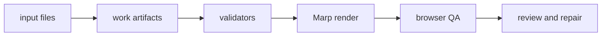

# slides-generator

[](https://github.com/haomingkoo/slide-generator/actions/workflows/ci.yml)

`slides-generator` is a source-grounded workflow for building presentation decks with Codex or Claude Code. It is designed for decks that need to be accurate, clear, visually checked, and honest about evidence.

This repo is not a one-prompt slide toy. The agent writes reviewable artifacts first, deterministic scripts validate those artifacts, then Marp renders an HTML/PDF/PPTX handoff deck for inspection.

## Quick Start

```bash
git clone git@github.com:haomingkoo/slide-generator.git
cd slide-generator
npm ci
npx playwright install chromium
npm test
```

On Linux CI, install Playwright system dependencies with:

```bash
npx playwright install chromium --with-deps
```

Render the committed fixture:

```bash
npm run render:marp -- tests/fixtures/render-project --html
npm run inspect:marp -- tests/fixtures/render-project
npm run qa:browser -- tests/fixtures/render-project
open tests/fixtures/render-project/deck/index.html
```

Run the source-backed eval deck:

```bash
npm run deck:build -- evals/source-backed/hackathon-rubric-eval --render
open evals/source-backed/hackathon-rubric-eval/deck/index.html
```

Generated eval `deck/` and `qa/` output is ignored by git and regenerated by `npm test`.

## How It Works



The important work happens before rendering:

- `claim-ledger.json`: every factual claim gets source, evidence, confidence, and allowed slide use.
- `audience-model.json`: audience questions, objections, jargon, and success criteria are explicit.
- `story-spine.json` and `slide-sorter.md`: the deck flow is reviewable before slide copy expands.
- `content-priority.md`: crowded material is split into main deck, backup, appendix, or dropped content.
- `design-contract.json`: visual direction, tokens, layout rules, and design decisions are durable.
- `slide-specs.json`: each slide has a job, claims, visual aid, speaker notes, and validation expectations.
- `review-log.json`: slide-by-slide feedback and repeated mistakes are recorded.

The deterministic scripts do not replace judgment. They make failures visible: missing claims, invalid claim refs, weak structure, bad slide specs, overflow, contrast issues, navigation issues, and stale generated output.

## Commands

| Command | Purpose |
|---|---|
| `npm run sync:skills` | Copy canonical skill files into Codex and Claude runtime mirrors. |
| `npm run init:deck -- projects/my-deck` | Create a local project scaffold. |
| `npm run workflow:status -- <project>` | Report which artifacts exist and what to repair next. |
| `npm run deck:build -- <project> --render --export` | Validate, render, run browser QA, and optionally export. |
| `npm run render:marp -- <project> --html` | Render `work/slide-specs.json` to Marp Markdown/HTML. |
| `npm run qa:browser -- <project>` | Run multi-viewport browser QA. |
| `npm run export:marp -- <project> --pptx --pdf` | Export after render/QA. |

The current Marp PPTX export is a visual handoff, not a native editable PowerPoint template. Native PPTX template editing and native Google Slides export are future work.

## Agent Entry Points

- Codex starts from [AGENTS.md](AGENTS.md) and the generated runtime skill at [.agents/skills/slide-generator/](.agents/skills/slide-generator/).
- Claude Code starts from [.claude/commands/make-deck.md](.claude/commands/make-deck.md) and the generated runtime skill at [.claude/skills/slide-generator/](.claude/skills/slide-generator/).
- The canonical skill source is [skills/slide-generator/](skills/slide-generator/).

Do not hand-edit `.agents/` or `.claude/` mirrors. Edit `skills/slide-generator/`, then run:

```bash
npm run sync:skills
npm test
```

## Repository Map

| Path | Role |
|---|---|
| `skills/slide-generator/` | Canonical skill instructions and runtime references. |
| `.agents/` | Generated Codex adapter for repo skill discovery. |
| `.claude/` | Generated Claude Code adapter and command entry point. |
| `scripts/` | Validators, scaffolders, renderer wrappers, QA, export, and sync tools. |
| `templates/` | Starter slide specs and design contracts. |
| `renderers/` | Marp themes and rendering assets. |
| `examples/` | Polished demos. |
| `evals/` | Source-backed eval inputs and durable `work/` artifacts; baseline comparison is roadmap. |
| `tests/` | Fixtures and negative guardrail tests. |
| `docs/` | Maintainer docs, package boundaries, architecture, roadmap, and policies. |
| `.agent-work/` | Local private review notes; ignored by git. |

## Quality Bar

A deck is not complete because it rendered. It is ready only when:

- required artifacts pass validation,
- factual slide claims map to the claim ledger,
- evidence gaps are resolved, caveated, moved to backup, or removed,
- browser QA passes,
- export QA passes when requested,
- speaker notes are usable for delivery,
- the review log has no unresolved high-severity slide issues.

See [docs/package-boundaries.md](docs/package-boundaries.md), [docs/architecture.md](docs/architecture.md), [docs/no-hallucination-policy.md](docs/no-hallucination-policy.md), and [docs/status-and-roadmap.md](docs/status-and-roadmap.md) for the detailed maintainer view.
