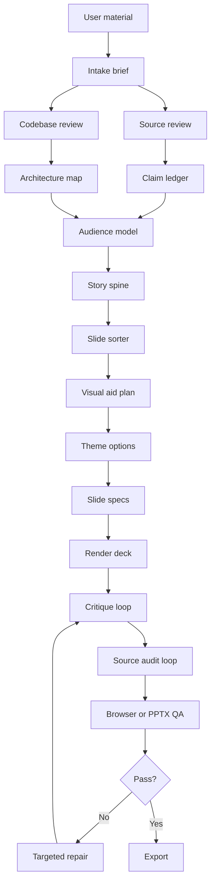

# slides-generator

[](https://github.com/haomingkoo/slide-generator/actions/workflows/ci.yml)

`slides-generator` is a repo for building source-grounded slide decks with agents.

The goal is not to make slides from a single prompt. The goal is to turn rough material into a deck that is accurate, clear, visually useful, and ready for a real presentation.

This repo is currently an early render-capable pipeline scaffold. It has the skill, planning structure, guardrails, validator scripts, eval prompts, CI, compatibility setup for Codex and Claude Code, and a first Marp-based HTML renderer.

## Quick Start

Clone and install:

```bash
git clone git@github.com:haomingkoo/slide-generator.git
cd slide-generator
npm ci
npx playwright install chromium
npm test
```

On Linux CI, install Playwright with system dependencies:

```bash
npx playwright install chromium --with-deps
```

Create a new local project scaffold:

```bash
npm run init:deck -- projects/my-deck --theme warm-editorial-light
npm run workflow:status -- projects/my-deck --render-ready
```

Render the committed fixture:

```bash
npm run render:marp -- tests/fixtures/render-project --html
npm run inspect:marp -- tests/fixtures/render-project
npm run qa:browser -- tests/fixtures/render-project
npm run export:marp -- tests/fixtures/render-project --pptx --pdf
```

Render the source-backed demo deck:

```bash
npm run agentic:run -- examples/source-grounded-demo --render --export
open examples/source-grounded-demo/deck/index.html
```

Open the generated HTML deck:

```bash
open tests/fixtures/render-project/deck/index.html
```

The HTML deck includes presenter controls and speaker notes. The PPTX export is the current PowerPoint and Google Slides handoff path. Native Google Slides API generation is planned, not claimed today.

Important PowerPoint boundary: the current Marp PPTX export is a visual handoff, not a native editable PowerPoint template. Text editability, slide masters, and brand-template editing are future work unless a separate native PPTX workflow is added for that deck.

Browser QA runs standard 16:9, laptop review, and smaller review windows by default. For faster iteration on one viewport:

```bash
npm run qa:browser -- projects/my-deck --viewport standard
```

## What This Repo Is

This is an agentic workflow repo.

It is not only a template pack, a renderer, or a prompt. It gives an agent a repeatable way to work:

```txt
ask the right questions
write durable artifacts
validate the artifacts
render the deck
inspect the rendered output
export only after QA
repair the artifact that failed
```

The agent still does the synthesis, story, design judgment, and copy work. The repo makes that work inspectable by forcing claims, audience assumptions, story beats, visual decisions, and rendered output into files that can be checked.

In practical terms, the repo has four layers:

- **Skill**: `skills/slide-generator/SKILL.md` and its Codex/Claude mirrors tell the agent how to behave.
- **Workflow**: `workflows/make-deck.md` and `skills/slide-generator/references/*.md` define the artifact sequence and repair loops.
- **Guardrails**: `scripts/*.mjs` validate claims, audience, story, design, slide specs, rendered HTML, and browser output.
- **Rendering assets**: `renderers/` and `templates/` turn checked slide specs into HTML, PPTX/PDF exports, and screenshots.

## How People Run It

There are two ways to use the repo today.

Use it as a renderer and validator:

```bash
npm run render:marp -- projects/my-deck --html
npm run inspect:marp -- projects/my-deck
npm run qa:browser -- projects/my-deck
npm run export:marp -- projects/my-deck --pptx --pdf
```

Use it agentically through Codex or Claude Code:

```txt
Use the slide-generator skill for projects/my-deck.

Follow workflows/make-deck.md.
Create planning artifacts first. Do not render until intake-brief, claim-ledger, audience-model, story-spine, slide-sorter, content-priority, visual-aid-plan, design-contract, and slide-specs are ready.
Use source_only mode unless the brief says research is allowed.
Stop for review after the rendered draft and QA report.
```

The second mode is the important one. A run is agentic only when the agent creates the artifacts, validates them, renders, inspects the browser output, records review feedback, and repairs the specific artifact that failed. If it only calls the renderer, it is not using the full system.

See `docs/agentic-execution.md` for how this maps to Deep Agents, LangGraph, or another runner later.

## Long-Running Agent Reliability

This workflow is designed so an agent can work for a long time without relying on chat memory.

The rule is simple: every important decision is written to disk before the agent moves on.

Durable state lives in:

```txt
projects/<name>/work/
  intake-brief.md
  source-map.md
  claim-ledger.json
  audience-model.json
  story-spine.json
  slide-sorter.md
  content-priority.md
  visual-aid-plan.json
  design-contract.json
  slide-specs.json
```

Rendered and QA state lives in:

```txt
projects/<name>/deck/
projects/<name>/qa/
```

Review memory lives in:

```txt
projects/<name>/work/review-log.json
```

If a session runs out of context or another agent takes over, resume by reading:

1. `work/intake-brief.md`
2. `work/claim-ledger.json`
3. `work/audience-model.json`
4. `work/story-spine.json`
5. `work/slide-sorter.md`
6. `work/content-priority.md`
7. `work/design-contract.json`
8. `work/slide-specs.json`
9. `work/review-log.json` if it exists
10. latest `qa/*` report

Then repair only the failed artifact. Do not reread the whole source corpus unless the claim ledger or source map is missing, stale, or disputed.

## Engineering Standard

The repo should not hide weak work behind polished output.

Rules:

- No hidden fallbacks. If the agent uses a default, fallback, or assumption, write it into the relevant artifact.
- No unexplained hardcoded choices. Colors, spacing, typography, slide count, output mode, and motion choices belong in a contract, template, or documented assumption.
- No hand-waving slides. A slide must have a clear job, audience purpose, visual aid purpose, and claim mapping when factual.
- No fake evidence. Do not invent sources, benchmarks, quotes, customers, screenshots, architecture paths, product claims, or code behavior.
- No silent downgrade. If PPTX, PDF, browser QA, animation, or an interactive aid cannot be validated, say what failed and use an explicit fallback.
- No overclaiming. Keep uncertainty and caveats visible when evidence is directional, incomplete, or inferred.
- No word blacklists. Technical terms such as "smoke test" are fine when they are accurate and useful; define them when the audience may not know them.

## Why This Exists

AI can already make a deck that looks finished. That is not the same as making a deck that is true, useful, and easy to present.

The common failure mode is simple: the model writes plausible slides before it has understood the sources, the audience, the story, or the proof. That creates decks with nice surfaces and weak foundations.

`slides-generator` is built around the opposite order:

1. understand the material,
2. decide what the audience needs,
3. verify the claims,
4. design the story,
5. choose visual aids,
6. render,
7. audit,
8. repair.

The repo is meant to help an agent create the first 90 percent of a strong deck while making the remaining 10 percent easy for a human to review.

## What This Is For

Use this repo when you want an agent to help create a serious deck from:

- rough notes,
- PDFs,
- codebases,
- screenshots,
- research material,
- brand guidelines,
- data files,
- existing slide examples.

The deck should explain the idea, not just decorate it. The workflow is especially useful for technical demos, research explainers, architecture decks, hackathon decks, product stories, and decision decks.

## Core Idea

Most AI slide tools do this:

```txt
prompt -> deck
```

This repo uses a safer flow:

```txt
sources -> evidence -> story -> visual aids -> render -> critique -> audit -> QA -> export
```

The important part is that every phase writes an artifact to disk. Those artifacts become the system memory, so a later repair does not need to reread every source file.

## Architecture At A Glance



The pipeline is intentionally split. A bad story should not be fixed by rewriting CSS. A false claim should not be fixed by changing the speaker notes. A crowded diagram should not require rereading every PDF.

## How To Use It Today

### One-Shot Draft Prompt

You should be able to ask for a strong first draft in one prompt, as long as the prompt gives the agent enough constraints.

```txt
Use the slide-generator skill for projects/my-deck.

Create a 10-slide deck about [topic] for [audience].
The deck should help them [understand, decide, believe, or do X].
Use source_only mode and strict source handling.
Use a clean surgical light style unless the sources suggest a better brand-derived direction.
Include visual aids where they clarify comparison, sequence, architecture, or tradeoffs.
Use step reveals or transitions only where they improve understanding, and include a static fallback.
Output an HTML draft with concise speaker notes. Export PPTX/PDF only after QA passes.
Prepare for likely questions, objections, and jargon risks.
Must include [specific items].
Must avoid unsupported claims, fake examples, and generic AI phrasing.

Before rendering, show me the slide sorter, theme direction, and assumptions.
```

If details are missing, the skill asks one batch of material questions. If you want speed, tell it to proceed with defaults. Those defaults should be recorded as assumptions in the project folder.

The first artifact after requirements gathering is `work/intake-brief.md`. It should contain:

- `deck_goal`: the one-sentence goal for the deck,
- `audience_shift`: what the audience should understand, believe, decide, or do differently,
- `success_criteria`: how the deck will be judged,
- `constraints`: time, slide count, source policy, output format, brand, and accuracy bar,
- `assumptions`: defaults the agent used,
- `open_questions`: unknowns that still matter.

Do not render until the goal is clear enough to judge every slide against it.

### Human Review Loop

The agent should work until it has a complete rendered draft and QA report, then stop for review.

Review together in this order:

1. Confirm the deck goal and audience shift.
2. Review the title-only story.
3. Walk slide by slide.
4. Mark each slide as `accept`, `copy_edit`, `visual_edit`, `claim_edit`, `story_edit`, or `remove_or_split`.
5. Write the results to `work/review-log.json`.
6. Repair only the affected artifacts.
7. Re-render and rerun QA.

The review log is how the workflow learns within a project. Repeated issues should become durable rules in `design-contract.json`, `audience-model.json`, `story-spine.json`, `claim-ledger.json`, or `slide-specs.json`.

### 1. Create A Project Folder

Copy the template:

```bash
cp -R projects/_template projects/my-deck
```

Rename `my-deck` to the deck name you want.

### 2. Add Input Material

Put files here:

```txt
projects/my-deck/input/
  brief.md
  sources/
  brand/
  codebase/
  data/
```

Use:

- `sources/` for PDFs, notes, transcripts, articles, or screenshots.
- `brand/` for brand guides, logos, example slides, or visual references.
- `codebase/` for code that the deck should explain.
- `data/` for CSVs, tables, benchmarks, or chart inputs.

Then fill:

```txt
projects/my-deck/input/brief.md
```

At minimum, write the topic, audience, goal, output format, research mode, and any style preference.

### 3. Ask Codex Or Claude Code To Run The Workflow

Use this prompt:

```txt
Use the slide-generator skill for projects/my-deck.

Follow workflows/make-deck.md.
Start with planning artifacts only. Do not render slides until the claim ledger, story spine, slide sorter, visual aid plan, and theme options are ready.
Use source_only mode unless the brief says research is allowed.
```

For Claude Code, you can also ask:

```txt
Use .claude/commands/make-deck.md for projects/my-deck.
Use the slide-generator skill.
```

If the deck involves code, add:

```txt
Review the codebase before planning slides. Create codebase-review.md, architecture-map.json, code-snippets.json, and demo-path.md before writing architecture slides.
```

If the deck involves a brand, add:

```txt
Create brand-contract.json before choosing the visual theme. Offer clean light and brand-derived options before rendering the full deck.
```

If the deck needs to stay visually consistent across iterations, add:

```txt
Create work/design-contract.json before rendering. Use it as the visual memory for theme tokens, spacing, typography, layout patterns, and design decisions.
```

### 4. Review The Planning Artifacts

Before rendering, inspect:

```txt
projects/my-deck/work/
  claim-ledger.json
  audience-model.json
  story-spine.json
  slide-sorter.md
  visual-aid-plan.json
  design-contract.json
  theme-options.md
```

The title-only story in `slide-sorter.md` should make sense without the body copy. `audience-model.json` should make the audience's likely questions, objections, and jargon tolerance explicit. If either fails, fix the story before rendering.

### 5. Choose Theme And Output Mode

Theme options are documented in `design-systems/`:

- `clean-surgical-light`: white, precise, minimal, academic or consulting friendly.
- `warm-editorial-light`: warmer product/demo storytelling.
- `dark-runtime`: technical architecture, security, observability, or dramatic demos.

Runnable Marp themes live in:

```txt
renderers/marp/themes/
```

Starter slide-spec templates live in:

```txt
templates/marp/
```

Starter design-memory templates live in:

```txt
templates/design-contracts/
```

Output modes:

- HTML artifact: best for interactive demos and custom visuals.
- HTML/PDF presentation: best for live delivery.
- PPTX export: best for PowerPoint or Google Slides handoff after HTML QA passes.
- Native editable PPTX template editing and native Google Slides API generation are future layers, not current claims.

### 6. Render, Critique, Audit, And Repair

After rendering, the agent should run:

```txt
critique loop
source audit loop
browser QA loop
targeted repair loop
```

Repairs should be scoped:

- Story issue: repair `story-spine.json` and `slide-sorter.md`.
- Claim issue: repair `claim-ledger.json` and affected slides.
- Diagram issue: repair `architecture-map.json` or the affected slide spec.
- Visual issue: repair only the affected slide spec and rerender.
- Theme issue: repair the theme layer without changing facts.

### 7. Render With Marp

The first executable renderer consumes `work/slide-specs.json` and writes a Marp Markdown deck. With `--html`, it also creates a standalone HTML presentation with presenter controls and notes.

```bash
npm run render:marp -- projects/my-deck --html
npm run inspect:marp -- projects/my-deck
npm run qa:browser -- projects/my-deck
npm run export:marp -- projects/my-deck --pptx --pdf
```

The renderer refuses to run unless the slide spec schema, claim ledger, slide claim references, and architecture map (when present) pass first.

Try the committed fixture:

```bash
npm run render:marp -- tests/fixtures/render-project --html
npm run inspect:marp -- tests/fixtures/render-project
open tests/fixtures/render-project/deck/index.html
```

To review each slide as an image, export screenshots:

```bash
npm run screenshots:marp -- tests/fixtures/render-project
open tests/fixtures/render-project/qa/screenshots
```

To run browser QA on the rendered HTML:

```bash
npm run qa:browser -- tests/fixtures/render-project
open tests/fixtures/render-project/qa/browser-qa.json
open tests/fixtures/render-project/qa/browser-screenshots
```

To export after the render and browser QA pass:

```bash
npm run export:marp -- tests/fixtures/render-project --pptx --pdf
open tests/fixtures/render-project/deck/exports
```

The PPTX export is also the current Google Slides handoff path: import the generated PPTX into Google Slides. Native Google Slides API export is planned later.

Generated fixture decks and screenshots are ignored by Git.

## Runtime Compatibility

This repo supports both Codex and Claude Code.

Codex uses:

```txt
.agents/skills/slide-generator/
```

Claude Code uses:

```txt
.claude/skills/slide-generator/
.claude/commands/make-deck.md
```

The development mirror is:

```txt
skills/slide-generator/
```

Run `npm test` after editing the skill. The validation script checks that all mirrors stay in sync.

## MCP And Tooling

The repo should work without MCP, but MCPs make the workflow better.

Useful integrations:

- GitHub MCP: inspect repos, issues, pull requests, and code references.
- OpenAI Docs MCP: check current OpenAI and Codex docs.
- Context7 MCP: check library and framework docs.
- Browser or Playwright tooling: screenshot slides and catch visual bugs.
- Filesystem tools: manage project artifacts.
- Web search/fetch: research mode with citations.
- PDF tooling: extraction, page rendering, OCR, table extraction.
- PPTX tooling: template analysis, thumbnails, XML editing, export QA.
- Design or Figma tooling: brand and layout references when available.

MCPs should support specific phases. They should not become a reason to skip the claim ledger, slide sorter, or QA loops.

## Product Lessons We Are Borrowing

The repo tracks durable workflow lessons from other tools in `skills/slide-generator/references/product-workflow-lessons.md`.

- Gamma: multiple intake modes, fast first draft, broad agent edits, card-level precision.
- Figma Slides: brainstorm-to-outline, template selection, design mode, collaboration, interactive prototypes and polls.
- Gemini in Google Slides: existing deck as style context, brand-matched editable slides, file-context retrieval.
- Canva: design direction, template breadth, asset libraries, and image-heavy layouts matter as much as generation.
- Plus AI: native PowerPoint/Google Slides workflow, outline review, insert/rewrite/remix operations, source-handling modes, and API/MCP surfaces.
- SlideSpeak: document-to-deck adapters, branded PowerPoint templates, outline-before-render, translation, presentation video, and API/MCP automation.

The point is not to copy any one product. The point is to keep the useful workflow patterns while adding stronger source grounding, auditability, and browser/PPTX QA.

Design-skill repos such as `claude-design-system-prompt` and `interface-design` reinforce two additional rules this repo adopts: design decisions should be remembered in a contract, and visual polish should run through explicit review gates for hierarchy, accessibility, clutter, and generic-design patterns.

## Existing Deck Operations

The workflow is not only for new decks. It should also handle common editing passes:

- proofread the whole deck,
- simplify dense slides,
- generate an executive summary,
- adapt for a different audience,
- translate and localize,
- rewrite titles as action titles,
- create agenda and section dividers,
- build from a website,
- build from a structured brief,
- generate speaker notes.

These operations are documented in `skills/slide-generator/references/deck-operations.md`. Each operation has a different context scope. For example, improving narrative flow needs the whole slide sorter, but fixing one dense slide should not reload the full source corpus.

## What The Skill Does

The main skill is:

```txt
.agents/skills/slide-generator/SKILL.md
```

It tells the agent to:

1. intake the deck job,
2. review sources,
3. review code if present,
4. build a claim ledger,
5. build an architecture map if needed,
6. create the audience model,
7. write the story spine,
8. build the slide sorter,
9. choose visual aids,
10. offer theme options,
11. create the design contract,
12. create slide specs,
13. render HTML,
14. critique,
15. audit claims,
16. run browser QA,
17. export PPTX/PDF when requested,
18. repair only what failed.

## No-Hallucination Rule

Every factual slide claim must appear in `claim-ledger.json`.

Claims are tagged as:

```txt
user_file
codebase
external_source
inference
assumption
```

The deck fails audit if it includes unsupported numbers, quotes, benchmarks, diagram nodes, diagram edges, customer claims, product claims, or code behavior.

The first deterministic checks are now executable:

```bash
node scripts/validate-claim-ledger.mjs projects/my-deck
node scripts/lint-claim-refs.mjs projects/my-deck
node scripts/validate-arch-map.mjs projects/my-deck
node scripts/validate-audience-model.mjs projects/my-deck
node scripts/validate-story-spine.mjs projects/my-deck
node scripts/validate-slide-specs.mjs projects/my-deck
node scripts/validate-design-contract.mjs projects/my-deck
```

`validate-claim-ledger.mjs` checks claim shape, allowed claim types, confidence values, duplicate IDs, and external source URLs. `lint-claim-refs.mjs` checks that slide specs reference real claim IDs and have no explicit unsupported claims. `validate-arch-map.mjs` checks that architecture nodes, edges, boundaries, and file/line evidence resolve. `validate-audience-model.mjs` checks audience segments, likely questions, objections, and jargon rules. `validate-story-spine.mjs` checks the audience shift, beats, transitions, and slide-job roles. `validate-slide-specs.mjs` checks renderer-supported layouts, slide jobs, visual-aid validation, motion rules, theme names, text budgets, table size, code length, and structured speaker notes before a deck can render. `validate-design-contract.mjs` checks the visual memory contract.

These checks do not replace source judgment. They make the basic contract fail fast before the model critiques its own work.

The test suite also includes negative fixtures. It checks that bad ledgers, missing claim references, unsupported claim uses, architecture path escapes, invalid absolute paths, and invalid line references are rejected.

## Visual Aid Catalog

The repo treats visual aids as core deck structure.

Useful patterns include:

- was/is,
- before/after,
- old world/new world,
- manual/assisted/autonomous,
- pipeline,
- runtime flow,
- loop map,
- state machine,
- probability shift,
- math stepper,
- decision tree,
- benchmark matrix,
- rubric scorecard,
- phone mockup,
- browser scene,
- code snippet proof,
- step reveal,
- subtle transition,
- animated sequence,
- interactive demo.

Animation and interaction are not decorative defaults. They must have a clear purpose, browser validation, reduced-motion or static fallback, and no unsourced claims.

See:

```txt
visual-catalog/
skills/slide-generator/references/visual-aid-catalog.md
```

## Evals

The first eval prompts live in:

```txt
evals/evals.json
tests/cases/
```

`npm test` currently validates the repo scaffold, the Codex/Claude skill mirrors, deterministic claim checks, audience/story contracts, design contracts, the Marp renderer, rendered HTML inspection, browser QA, and negative validator fixtures.

Current cases:

- DPO teaching deck.
- PDF parser decision deck.
- Codebase architecture deck.

Run these as pairs:

```txt
baseline one-shot prompt
with slide-generator skill
```

Then compare:

- title-only story,
- claim traceability,
- visual aid choices,
- diagram correctness,
- speaker notes,
- token usage,
- time,
- amount of human repair needed.

The intended eval loop is:

```txt
with skill output
vs
baseline one-shot output
```

Then compare story quality, source grounding, visual aid choices, speaker notes, token use, and time.

## Useful Docs

- `docs/workflow.md`: full slide production flow.
- `docs/architecture.md`: repo architecture.
- `docs/agentic-execution.md`: how the workflow executes today and how it can map to Deep Agents or LangGraph later.
- `docs/status-and-roadmap.md`: current status and next implementation steps.
- `docs/renderer-strategy.md`: HTML-first renderer plan and Marp-style target.
- `docs/no-hallucination-policy.md`: accuracy rules.
- `docs/quality-rubric.md`: deck quality checklist.
- `skills/slide-generator/references/deck-operations.md`: common edit and transformation operations.
- `skills/slide-generator/references/audience-and-presenter-support.md`: audience model, story spine, speaker notes, jargon, objections, and Q&A.
- `skills/slide-generator/references/design-contract.md`: persistent design memory for theme tokens, patterns, and decisions.
- `skills/slide-generator/references/design-quality-gates.md`: visual hierarchy, accessibility, clutter, and polish gates.
- `docs/skill-eval-loop.md`: how to test and improve the skill.
- `docs/runtime-compatibility.md`: Codex and Claude Code compatibility.
- `docs/codex-ecosystem.md`: Codex-native skill/plugin notes.

## Validate The Scaffold

Run:

```bash
npm test
```

This checks required files, eval schema, skill mirror consistency, deterministic claim validators, deterministic architecture evidence validation, audience/story validation, slide-spec validation, design-contract validation, Marp fixture rendering, rendered HTML inspection, browser QA, and negative validator fixtures.

## Current Status

Done:

- workflow design,
- Codex and Claude Code skill mirrors,
- no-hallucination policy,
- memory strategy,
- visual aid catalog direction,
- brand, PDF, PPTX, frontend, and codebase references,
- eval cases,
- deterministic claim-ledger validation,
- deterministic slide claim-reference validation,
- deterministic architecture evidence validation,
- deterministic audience-model validation,
- deterministic story-spine validation,
- deterministic slide-spec validation,
- deterministic design-contract validation,
- first Marp HTML renderer,
- rendered HTML inspection,
- browser QA,
- PPTX/PDF export command,
- optional Marp screenshot export,
- three Marp themes,
- pitch, teaching, and technical architecture slide-spec templates,
- negative validator fixtures,
- GitHub CI.

Next:

- implement artifact generators,
- add a real source-backed rendered eval deck,
- add brand observation tooling,
- add PPTX-specific export QA,
- add native Google Slides API handoff after auth and formatting risks are designed,
- run the first real eval against a baseline.

## License

No open-source license has been selected yet. Until a license is added, all rights are reserved by default.

## First Real Test To Run

The best first test is the PDF parser decision deck or the DPO teaching deck.

Recommended prompt:

```txt
Use the slide-generator skill to create planning artifacts for the PDF parser comparison deck.

Audience: engineering lead.
Goal: decide what parser pipeline to use for complaint forms.
Research mode: source_only.
Theme: clean-surgical-light.
Output: planning artifacts first, no rendering yet.

Create the claim ledger, story spine, slide sorter, visual aid plan, and theme options. Then stop for review.
```

After that, run a baseline one-shot prompt on the same material and compare the outputs. If the skill does not clearly produce a better plan, the skill needs another iteration.
