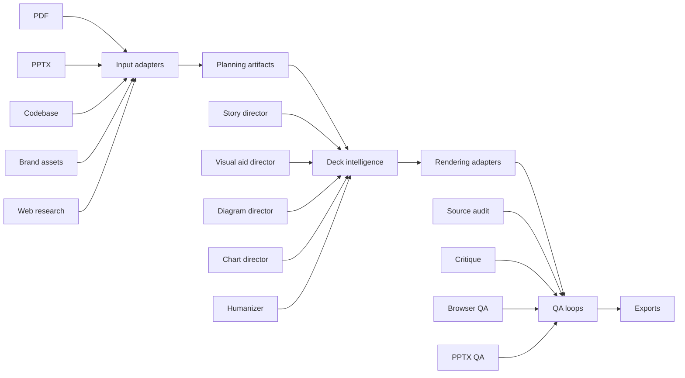

# Repository Architecture

`slides-generator` is an artifact-first deck production system. The repo separates input adapters, planning, rendering, critique, and audit so each phase can be tested and repaired without redoing the whole deck.

## System Components

## Adapters

- PDF adapter: extracts text, tables, page images, figures, and OCR when needed.
- PPTX adapter: reads existing decks, extracts layouts, analyzes thumbnails, and creates or edits PPTX outputs.
- Codebase adapter: maps architecture and extracts slide-worthy snippets.
- Brand adapter: derives palette, typography, layout density, and visual constraints.
- Frontend adapter: renders HTML decks and interactive visual aids with production-grade UI discipline.

## Core Principle

Input adapters produce evidence. Planning artifacts turn evidence into a story. Rendering adapters express the story. QA loops prevent unsupported, unreadable, or generic output from shipping.

## Codex-Native Skill Path

The repo skill should live in `.agents/skills/slide-generator` so Codex can discover it as a repo-scoped skill. Keep helper scripts and reference files inside the skill so they load only when needed.
