# Architecture

`slides-generator` is an artifact-first deck workflow. The stable contract is a project directory with `input/`, `work/`, generated `deck/`, and generated `qa/` folders.

## Pipeline

```mermaid
flowchart LR
  A[input/brief.md + sources] --> B[work/intake-brief.md]
  B --> P[work/deck-plan.md]
  P --> C[work/source-map.md]
  C --> D[work/claim-ledger.json]
  D --> E[work/audience-model.json]
  E --> F[work/story-spine.json + slide-sorter.md]
  F --> G[work/content-priority.md + visual-aid-plan.json]
  G --> H[work/design-contract.json + quality-rubric.json]
  H --> I[work/slide-specs.json]
  I --> J[scripts/render-marp.mjs]
  J --> K[scripts/browser-qa-marp.mjs]
  K --> L[qa/slide-scorecard.json + repair-plan.json]
  L --> M[work/review-log.json]
```

## Executable Layers

| Layer | Files | Responsibility |
|---|---|---|
| Scaffold | `scripts/create-deck-artifacts.mjs` | Create a project shell with starter input/work folders. |
| Status gate | `scripts/deck-workflow-status.mjs` | Report missing or failed artifacts and enforce render-ready/agentic gates. |
| Source grounding | `scripts/validate-claim-ledger.mjs`, `scripts/lint-claim-refs.mjs` | Check claim schema, source URLs, claim IDs, and allowed slide uses. |
| Code evidence | `scripts/validate-arch-map.mjs` | Check architecture nodes, edges, boundaries, and file/line evidence. |
| Audience/story/design | `scripts/validate-audience-model.mjs`, `scripts/validate-story-spine.mjs`, `scripts/validate-design-contract.mjs` | Check core presentation contracts before rendering. |
| Quality target | `scripts/validate-quality-rubric.mjs` | Check mode-specific thresholds, hard gates, weighted dimensions, and role prompts. |
| Slide contract | `scripts/validate-slide-specs.mjs` | Check renderer-supported layouts, jobs, motion, visual aid validation, and text budgets. |
| Render | `scripts/render-marp.mjs`, `renderers/marp/themes/*` | Convert slide specs to Marp Markdown/HTML and speaker notes. |
| QA/export | `scripts/inspect-rendered-marp.mjs`, `scripts/browser-qa-marp.mjs`, `scripts/export-marp.mjs`, `scripts/inspect-exports.mjs` | Inspect rendered structure, browser output, and export boundaries. |
| Quality loop | `scripts/validate-slide-scorecard.mjs`, `scripts/validate-repair-plan.mjs`, `scripts/score-deck.mjs`, `scripts/iterate-deck.mjs` | Validate researcher/critic/designer scorecards and targeted repair plans; numeric scores guide repair but do not prove quality. |
| Mirrors | `scripts/sync-skills.mjs` | Keep Codex and Claude runtime skill folders synchronized with canonical source. |

## Agent Layer

The agent is responsible for synthesis and judgment:

- requirements gathering,
- source review,
- audience framing,
- story pruning,
- slide copy,
- visual aid selection,
- screenshot critique,
- researcher/critic/designer scoring,
- targeted repair.

The scripts are intentionally conservative. They can reject unsupported or malformed work, but they cannot prove that a slide is brilliant. Final quality still requires screenshot review and human or agent critique.

## Current Output Boundary

HTML is the first-class review format. Marp can export PDF and PPTX, but current PPTX output should be treated as a visual handoff unless export inspection proves editable text support for that deck.

Native PowerPoint template editing and native Google Slides generation are not implemented yet.
