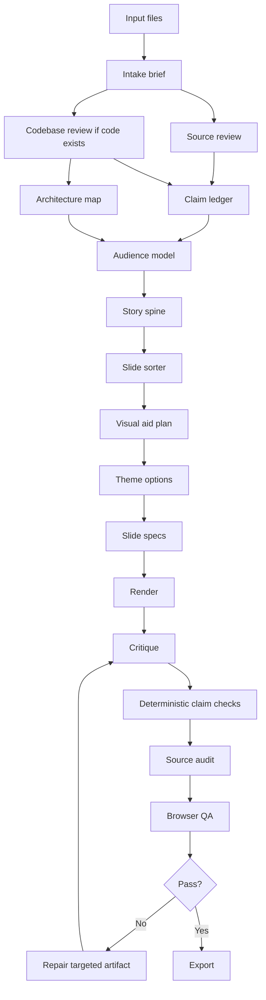

# Slides Generator Workflow

The repo builds decks from verified planning artifacts. Do not generate slides directly from raw notes.

## Pipeline

## Planning Artifacts

Every project should produce these files in `projects/<name>/work/` before rendering:

- `intake-brief.md`: audience, purpose, format, tone, constraints, research mode.
- `source-map.md`: what files were read and what each source contributes.
- `codebase-review.md`: important files, flows, demo path, risks, snippets.
- `architecture-map.json`: nodes, edges, boundaries, and source evidence.
- `claim-ledger.json`: factual claims with source links and confidence.
- `audience-model.json`: what the audience knows, needs, doubts, and decides.
- `story-spine.md`: the talk's throughline and narrative arc.
- `slide-sorter.md`: slide titles only, in order.
- `visual-aid-plan.json`: visual pattern selected for each hard idea.
- `theme-options.md`: 2 or 3 proposed directions before final selection.
- `slide-specs.json`: precise slide instructions for rendering.
- Deterministic checks: `scripts/validate-claim-ledger.mjs` and `scripts/lint-claim-refs.mjs`.

## One-Shot Drafting

The repo should support a strong first draft from one prompt. One-shot does not mean skipping planning. It means capturing the right constraints up front and then writing the artifacts quickly.

The first prompt should resolve:

- audience,
- decision or learning goal,
- live vs async use,
- slide count or talk length,
- source policy,
- source-handling mode,
- output format,
- brand and style direction,
- visual aid expectations,
- speaker notes,
- must-include and must-avoid items.

If material details are missing, ask once in a batch. If the user wants momentum, proceed with defaults and record them as assumptions in `intake-brief.md`.

## Memory Strategy

The pipeline is designed to avoid burning tokens on full-deck rereads.

- Whole-deck passes are reserved for story flow, conciseness, and title-only review.
- Slide-local passes repair one slide using its `slide_spec`, screenshot, and related claim IDs.
- Source audits check claim IDs against the ledger instead of rereading every file.
- Code audits use snippet IDs and architecture IDs instead of reloading the whole codebase.
- Theme repairs use the selected design system and screenshot, not the full source corpus.

When the user asks to improve the overall flow, read the slide sorter and story spine first. When the user asks to make text concise, read all slide copy. When the user asks to fix one ugly slide, read only that slide's spec, screenshot, and theme.

## Research Modes

- `source_only`: use only user-provided files and code.
- `source_first`: use user files first, research only to fill explicitly identified gaps.
- `broad_research`: research externally with citations and keep external claims separate.
- `style_research`: research design references only; do not add factual claims to content.

The default is `source_only` unless the user asks for current or external information.

## Output Modes

- `html_artifact`: best for interactive teaching decks, animations, demos, and custom diagrams.
- `presentation_html_pdf`: best for live delivery with speaker notes and PDF export.
- `editable_pptx`: best when the user needs PowerPoint editing, slide masters, and native text.

HTML can be more expressive. PPTX must be more constrained and theme-aware.

## Input Adapters

- PDF inputs must preserve page-level traceability and OCR caveats.
- PPTX inputs must be analyzed visually and textually before reuse.
- Brand inputs create a `brand-contract.json` before theme selection.
- Code inputs create `codebase-review.md`, `architecture-map.json`, and `code-snippets.json`.
- Web research inputs must remain separate from user-provided source claims.
