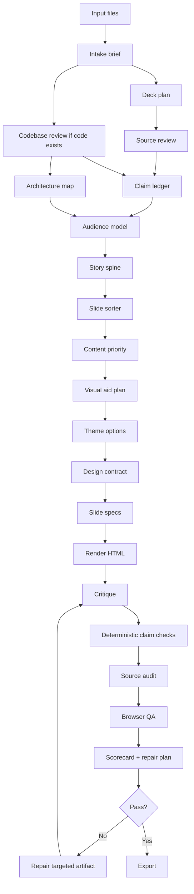

# Slides Generator Workflow

The repo builds decks from verified planning artifacts. Do not generate slides directly from raw notes.

## Pipeline

## Planning Artifacts

Every project should produce these files in `projects/<name>/work/` before rendering:

- `intake-brief.md`: audience, purpose, format, tone, constraints, research mode.
- `deck-plan.md`: deck job, target next action, audience shift, proof spine, research plan, slide logic, theme direction, QA plan, assumptions and open questions.
- `source-map.md`: what files were read and what each source contributes.
- `codebase-review.md`: important files, flows, demo path, risks, snippets.
- `architecture-map.json`: nodes, edges, boundaries, and source evidence.
- `claim-ledger.json`: factual claims with source links and confidence.
- `audience-model.json`: what the audience knows, needs, doubts, and decides.
- `story-spine.json`: the audience shift, throughline, beats, transitions, likely questions, and handled objections.
- `slide-sorter.md`: slide titles only, in order.
- `content-priority.md`: main-deck, backup, appendix, and dropped-content decisions against the timing and audience budget.
- `visual-aid-plan.json`: visual pattern selected for each hard idea.
- `theme-options.md`: 2 or 3 proposed directions before final selection.
- `design-contract.json`: theme tokens, spacing, typography, patterns, and design decisions.
- `quality-rubric.json`: deck mode, hard gates, score threshold, weighted dimensions, and role review prompts.
- `slide-specs.json`: precise slide instructions for rendering.
- `qa/slide-scorecard.json`: researcher, story, designer, and critic review scores after rendering. Scores guide repair; they do not certify quality.
- `qa/repair-plan.json`: smallest targeted repairs needed to cross the quality threshold.
- Deterministic checks: claim ledger, claim refs, architecture map, audience model, story spine, design contract, quality rubric, slide specs, rendered HTML, browser QA, scorecard, repair plan.

## One-Shot Drafting

The repo should support a strong first draft from one prompt. One-shot does not mean skipping planning. It means capturing the right constraints up front and then writing the artifacts quickly.

The first prompt should resolve:

- audience,
- decision or learning goal,
- live vs async use,
- slide count or talk length,
- key message and required themes,
- likely questions and objections,
- jargon baseline,
- backup evidence depth,
- motion or interaction expectations,
- source policy,
- source-handling mode,
- output format,
- brand and style direction,
- visual aid expectations,
- speaker notes,
- must-include and must-avoid items.

The intake phase must produce a clear deck goal before planning:

- `deck_goal`: what the deck must accomplish in one sentence,
- `audience_shift`: what the audience should understand, believe, decide, or do differently,
- `success_criteria`: how the deck will be judged,
- `constraints`: time, slide count, source policy, output format, brand, and accuracy bar,
- `content_priority`: what belongs in main, backup, appendix, or dropped content,
- `assumptions`: defaults the agent used,
- `open_questions`: unknowns that still matter.

If material details are missing, ask once in a batch. If the user wants momentum, proceed with defaults and record them as assumptions in `intake-brief.md`.

For client-facing or research-heavy decks, also complete `deck-plan.md` before rendering. The plan should make the story and proof bar clear enough that a reviewer can critique the deck before seeing any slide design.

See [research-to-deck-guide.md](research-to-deck-guide.md) for the practical workflow used by polished examples.

## Memory Strategy

The pipeline is designed to avoid burning tokens on full-deck rereads.

- Whole-deck passes are reserved for story flow, conciseness, and title-only review.
- Slide-local passes repair one slide using its `slide_spec`, screenshot, and related claim IDs.
- Source audits check claim IDs against the ledger instead of rereading every file.
- Code audits use snippet IDs and architecture IDs instead of reloading the whole codebase.
- Theme repairs use the selected design system and screenshot, not the full source corpus.

When the user asks to improve the overall flow, read the slide sorter and story spine first. When the user asks to make text concise, read all slide copy. When the user asks to fix one ugly slide, read only that slide's spec, screenshot, and theme.

## Research Modes

- `source_only`: use only user-provided files and code.
- `source_first`: use user files first, research only to fill explicitly identified gaps.
- `broad_research`: research externally with citations and keep external claims separate.
- `style_research`: research design references only; do not add factual claims to content.

The default is `source_only` unless the user asks for current or external information.

## Output Modes

- `html_artifact`: best for interactive teaching decks, animations, demos, and custom diagrams.
- `presentation_html_pdf`: best for live delivery with speaker notes and PDF export.
- `editable_pptx`: best when the user needs PowerPoint handoff. Current support is Marp PPTX export after HTML QA, not native template editing.
- `google_slides_handoff`: export PPTX first, then import into Google Slides. Native Google Slides API export is future work.

HTML can be more expressive. PPTX must be more constrained and theme-aware.

Current Marp PPTX exports should be treated as visual handoff files unless `qa/export-inspection.json` shows editable text runs. If the audience needs editable PowerPoint text, use a native PPTX workflow instead of relying on Marp export.

## Browser QA

`scripts/browser-qa-marp.mjs` checks multiple review windows by default:

- `standard-16x9`: 1280 x 720,
- `laptop-review`: 1366 x 768,
- `small-window`: 1024 x 576.

Use `--viewport standard` for a faster single-window iteration. Use the default multi-viewport run before export.

## Input Adapters

- PDF inputs must preserve page-level traceability and OCR caveats.
- PPTX inputs must be analyzed visually and textually before reuse.
- Brand inputs create a `brand-contract.json` before theme selection.
- Code inputs create `codebase-review.md`, `architecture-map.json`, and `code-snippets.json`.
- Web research inputs must remain separate from user-provided source claims.
